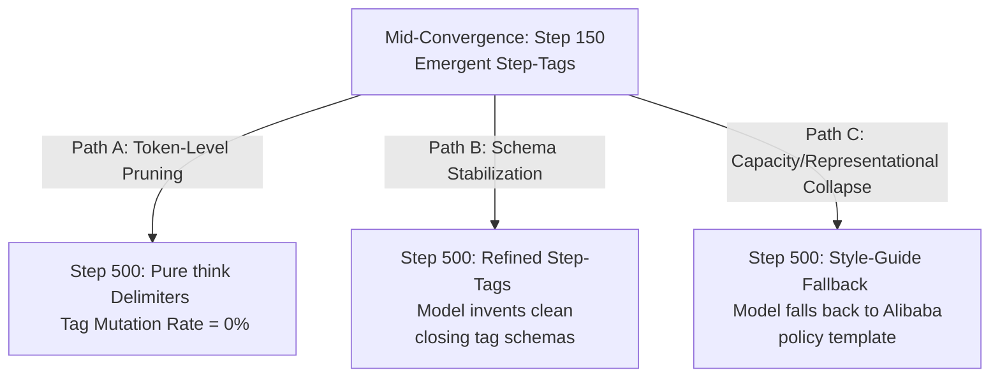

# 500-Step GRPO Experiment Protocol: Probing Pre-Convergence Formatting Schemas
**Alethia Research Group**  
**Date: 2026-05-29**  
**Status: READY FOR EXECUTION**  

---

## 1. Context & Objective

During Phase 4 evaluation of the Step-GRPO trained model (`Qwen2.5-1.5B-Instruct` + Step-GRPO LoRA, 150 steps), we discovered a highly structured, emergent delimiter mutation: **`<Step1>`, `<Step2>`, `<Step3>`, and `<p>` tags emerged zero-shot on out-of-distribution prompts, despite never being present in the SFT or GRPO training data.** 

We proposed that at 150 steps, the model was captured in a **"mid-convergence" state**—where it had mastered the *abstract syntax* of XML formatting brackets but had not yet *fully refined or localized* the exact token string to `think`. 

This protocol establishes the exact experimental guidelines for executing a **500-step GRPO training run** to characterize the long-term evolutionary trajectory of these emergent Delimiters.

---

## 2. The Three Competing Predictions

By running the training to 500 steps, we will actively falsify or confirm one of three structural attractors:



### Prediction A: The Token-Level Pruning Attractor (Highly Probable)
*   **Mechanism:** Under extended training, the strict binary format reward ($R_{\text{format}} = 1.0$ for literal `<think>`, $0.3$ for multi-block/invented tags) will act as a strong evolutionary pressure. The model will completely prune all `<StepX>` and `<p>` mutations, forcing the policy to collapse entirely into the exact, rigid token string `<think>`.
*   **Metric Signature:** Emergent tag mutation rate drops to **0%** by step 300 and remains at zero.

### Prediction B: Schema Stabilization (Highly Novel)
*   **Mechanism:** If the central engine's logical mapping of sequential reasoning steps is a highly stable cognitive attractor, the model will refuse to suppress the steps. Instead, it will *refine the syntax*, learning to open and close tags cleanly (e.g., `<Step1>...</Step1>`) to minimize penalties while maintaining the semantic partition.
*   **Metric Signature:** Tag mutation rate remains stable or increases, but the syntax errors (e.g., `<Step2>` closed by `</think>`) disappear, replaced by clean, self-consistent XML schema tags.

### Prediction C: Capacity/Representational Collapse (The Risk)
*   **Mechanism:** Running standard GRPO (all layers) to 500 steps will continuously back-propagate RL gradients through the central engine (L0–L23). This accumulated gradient noise will corrupt core capability circuits, causing the model's math accuracy to collapse and triggering an alignment fallback to standard Alibaba system prompts.
*   **Metric Signature:** GSM8K correctness drops below **30%**, and completions revert entirely to legacy instruct formats.

---

## 3. The Recommended Hyperparameters

To ensure training stability across 500 steps on a single T4 GPU (Google Colab) and prevent representational collapse, we specify two alternative setups:

### Setup 1: Frozen-Layer GRPO (LF-GRPO) — **STRONGLY RECOMMENDED**
Freezing L0–L23 is critical for a 500-step run to insulate the central logic engine from gradient erosion while allowing the periphery (L24–L27) to fully refine the formatting schema.

| Parameter | Recommended Value | Rationale |
|---|---|---|
| `--max_steps` | `500` | Extends training past the 150-step pre-convergence window |
| `--stage_steps` | `100` | Extends Stage 1 (formatting) to lock in delimiter syntax |
| `--layers_to_transform` | `last_4` | Adapts only L24–L27, freezing L0–L23 (100% gradient insulation) |
| `--learning_rate` | `1.5e-5` | Slightly lower LR to prevent policy divergence over 500 steps |
| `--save_steps` | `100` | Saves checkpoints at steps 100, 200, 300, 400, 500 for post-hoc analysis |

### Setup 2: Standard GRPO (Control)
Use this setup to measure the exact rate of central engine degradation under extended all-layer RL updates.

*   Same as Setup 1, but omit the `--layers_to_transform` flag.

---

## 4. Execution Plan & Commands

To run this experiment on Google Colab, copy-paste and execute the following commands.

### Phase A: Run the 500-Step LF-GRPO Training
This command launches Step-GRPO with a decaying step penalty, confined only to the last 4 periphery layers:

```bash
python src/train_grpo.py \
    --model_name unsloth/Qwen2.5-1.5B-Instruct \
    --mode step-grpo \
    --max_steps 500 \
    --stage_steps 100 \
    --learning_rate 1.5e-5 \
    --layers_to_transform last_4 \
    --save_steps 100 \
    --output_dir ./grpo_lf_500_output
```

### Phase B: Monitor Emergent Tag Mutations in Real-Time
The training script is now equipped with the **Syntactic Generalization Monitor**. During execution, monitor the console logs. If the model generates novel tags, it will print a block highlighting the exact tag occurrences in the batch:

```
==================================================
[!] EMERGENT TAG MUTATION DETECTED (Step 240)
    Unique invented tags: ['Step1', 'Step2', 'p']
    Occurrences: [('p', 4), ('Step1', 1), ('Step2', 1)]
==================================================
```

### Phase C: Generate the Post-Run Diversity Report
Once training completes, load the saved final LoRA adapters, run evaluations on the OOD test set to generate the JSONL completion file, and execute the analysis script to verify if the step tags were pruned, stabilized, or collapsed:

```bash
# 1. Run evaluation on 50 OOD questions
python src/eval_gsm8k_light.py \
    --model_path ./grpo_lf_500_output/final_lora \
    --limit 50

# 2. Analyze the completions
python src/analyze_grpo_outputs.py outputs.jsonl
```

---

## 5. Strategic Deliverable

The findings from this 500-step run will be compiled directly into **Section 11 (GRPO & LF-GRPO)** and **Section 12 (Unified Theory Discussion)** of the LaTeX paper draft. 

If **Prediction A** is confirmed, it proves that reinforcement learning on strict formatting rewards acts as an active vector pruning filter. If **Prediction B** is confirmed, it represents a landmark finding in mechanistic interpretability—proving that LLMs can structurally generalize novel XML schemas online under OOD math load.

*Alethia Research — Truth, not comfort.*
